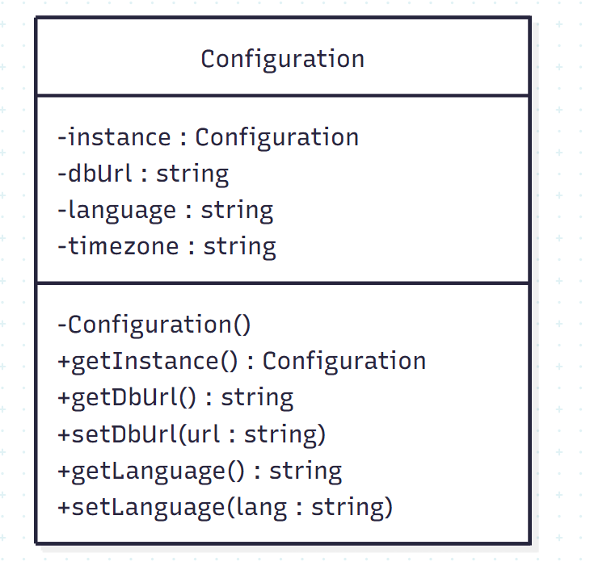

1.1 Le pattern Singleton car tous les modules utilisent les mêmes paramètres et il y a aussi du coup une seule instance de configuration qui sont accessible partout dans l'APP
1.2 
1.4 avantage : Une seule instance, simple et cohérent 
inconvenient : necessite une bonne utilisation et peut rendre compliquer les tests

2.1 Factory Method 
2.2 public interface IVehicle = Produit
Car, Motorcycle et Truck = Les produits
public abstract class VehicleFactory = Celui qui creer
public abstract IVehicle CreateVehicle(); = Factory Method 
CarFactory, MotorcycleFactory et TruckFactory = Produits créer 
2.3  OrderVehicle() est une methode Template et son role est de defenir un process pour la création en utilisant  CreateVehicle mais sans connaitre le quelle il vas creer cette etape est a sa sous-classes
2.4 Le Factory Method délégue la creation d’un objet à une sous-classe, alros l’Abstract Factory permet de liés l'objet creer

3.1 Les décorateurs ne sont pas lié avec un café existant il en creer 1 a chaque fois 
- le prix est remplacer au lieu d'être additionner 
- On ne peut pas combiner cafe et lait car il retourne cafe + .... 

4.1 les violations des principes SOLID dans ce code sont :

- La classe NotificationService gere trop de type email, sms, slack...
- Si on souhaite ajouter des type il faut modifier la methode SendNotification alors que ca devrait pas etre le cas

4.2 Pattern Strategy pour que chaque type soit une strategie et en plus de cela qui vas permettre de pouvoir scaler par la suite si on souhaite ajouter ou supprimer sans modifier SendNotification

5.1 le Pattern est Composite 
5.2 IComponent est Interface commune qui sert lui a defir les methodes comme Add ect 
Leaf lui implemente juste Operation
Composite vas gerer les enfant de Add ect 

5.3 Cas d’usage
Leaf = fichier et Composite = Dossier
Un dossier peut contenir des fichiers donc des Leafs

5.4 sépare les interfaces
En gros : IComponent --> Operation 
IComponent --> Add, Remove... 